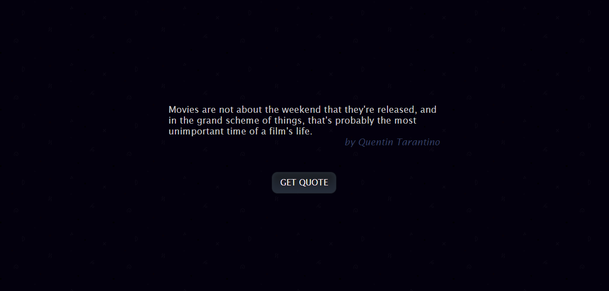
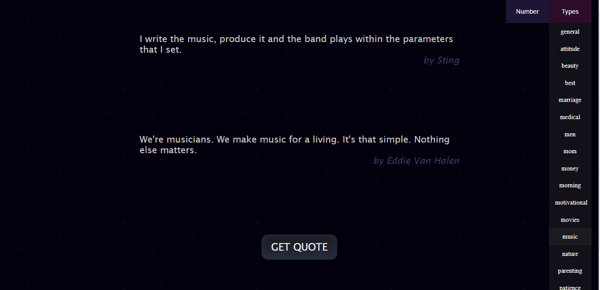

# QuotesGenerator

> a random quote generator

  
 

A random quote generator that displays a random quote to the user every time they press a button. User can choose number and type of quotes (general, motivational, movies, music ect.) that will be generated.

All of the data is fetched using a [public API.](<https://goquotes.docs.apiary.io/#reference/get-random-quote(s)/apiv1random>)

## Built with

- ReactJS, Redux
